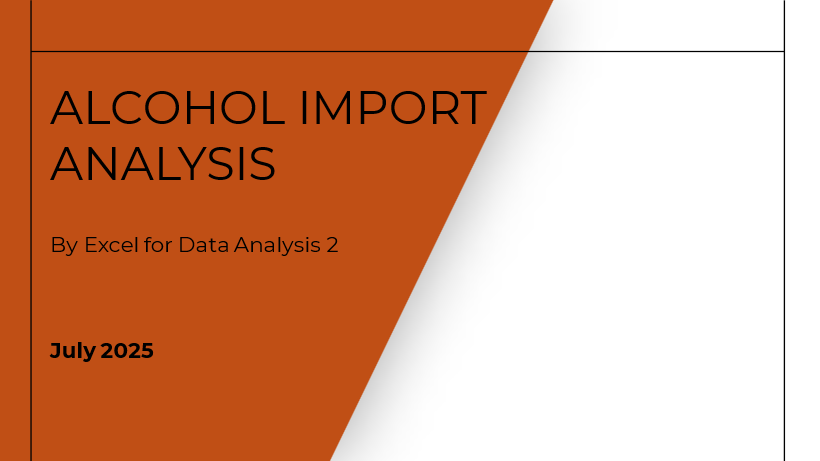
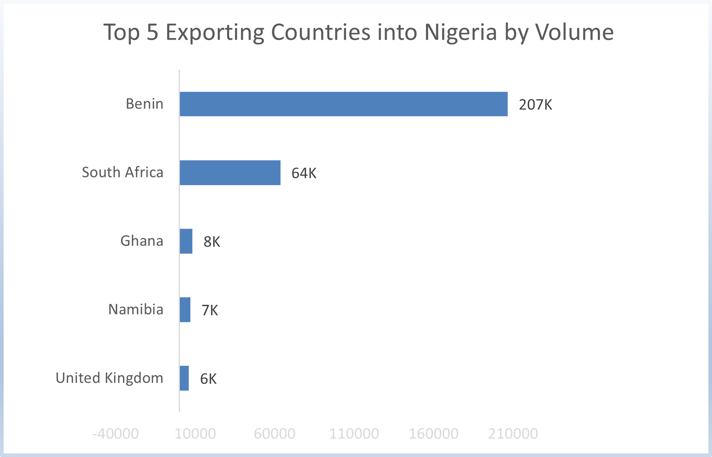
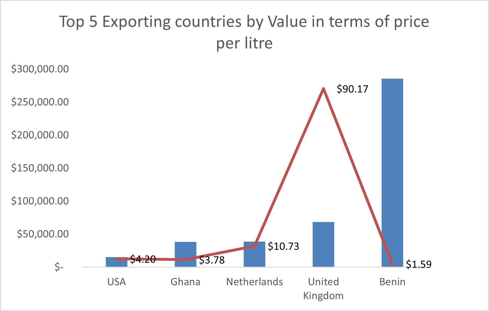
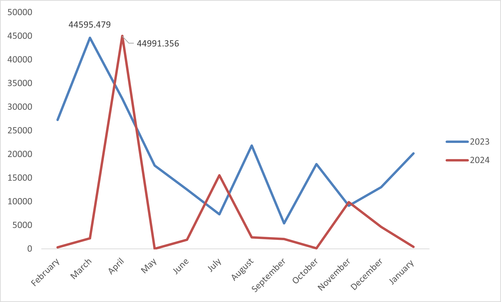

## Cohort-Gitghub-demo
This is a demo for data analysis project documentation.

## INTRODUCTION
As in most other societies, alcoholic beverages have been consumed in what is present-day Nigeria for a long time. Before the arrival of western factory-made drinks, alcohol consumption was limited to a variety of beverages produced from palm trees and food grains. But today with a high level of accessibility to trade, Nigeria has leveraged this opportunity to serve its ever-growing population demand for alcoholic beverages, especially for foreign brands.
## Problem Statement
Despite the growing interest in alcoholic beverages, there is limited visibility into the specific trends and patterns of alcohol imports. Key questions include:

- Which countries are the top import sources?
- Top inporting countries by value and Volume?
- Price per Litre of Imports with respect to volume?
- Average price per country?
## Data Source
The primary data source for this analysis is the UN Comtrade Database. The dataset was extracted using the following parameters:

- Reporter Country: Nigeria
- Partner Countries: All
- Product: Alcoholic beverages (HS Codes 2203 – 2208)
- Period: 2023 & 2024
- Trade Flow: Imports

## Data Transformation / Cleaning
This data was prepared and cleaned on Microsoft Excel and Power Query
## Insights    
Base on the analysis
- It is cheaper to import from Benin at an avg price of $1.59
- Imports from the UK was an outlier in the analysis as the cost per litre is more than combined of the remaining countries.

Imports by Volume           |  By value
:-------------------------: | :--------------------------------:
  | 

Time series                 |  
:-------------------------: | :--------------------------------:
        |  

## Recommendation
Based on the analysis:

- We encourage a deeper dive to understand the imports from benin as it is not an alcohol producing nation.
- Access to paid databases will help for more in-dept analysis, which will aid informed decision making.
- It is recommended that the company looks into subscribing for one or more, that meets its business requirements or current need.
- Explore potential for local substitutes in high-import categories (e.g., spirits).

### Thank you for taking time to read this analysis. 🙏

